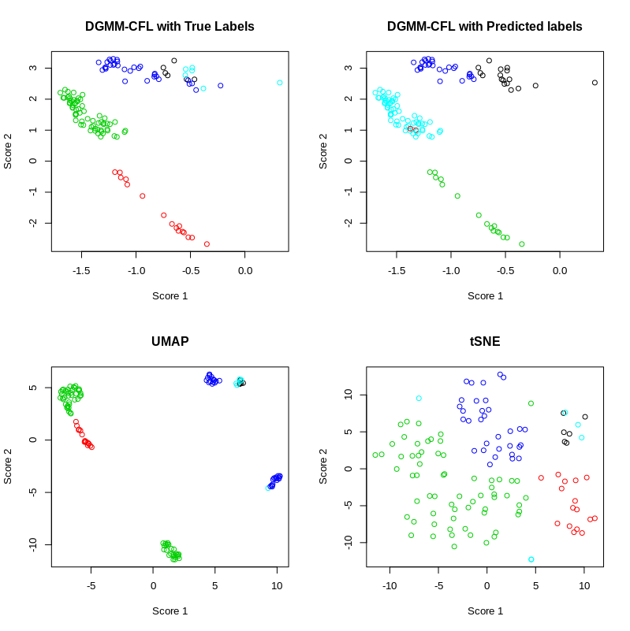

# Deep Gaussian Mixture Models with Common Factor Loadings

A model-based method enabling dimensionality reduction, unsupervised clustering, and visualisation.

See example.R for more details on implementation.

This is a culmination of my Thesis project for the Master in Science (Statistics), supervised by Professor Geoffrey McLachlan.

Note, the thesis attached is a preliminary copy. Updates will be made as time progresses.

It is based on the following work, so please reference the following:

https://github.com/suren-rathnayake/deepgmm/blob/master/

https://github.com/suren-rathnayake/EMMIXmfa

[Viroli, C. and McLachlan, G.J. (2019). Deep Gaussian mixture models. Statistics and Computing 29, 43-51.](https://link.springer.com/article/10.1007/s11222-017-9793-z)

